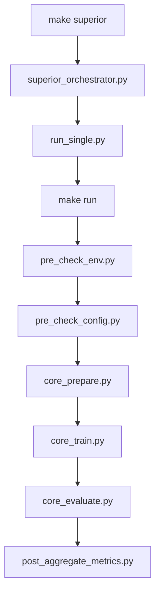

# 1. Vue d’ensemble du pipeline

Le projet est un **pipeline de classification de textes** piloté par :

* un **Makefile** (point d’entrée),
* des **fichiers de config YAML** (profils + presets),
* un **core** en 3 scripts : `core_prepare.py`, `core_train.py`, `core_evaluate.py`,
* une **couche “superior”** (orchestrateur) pour lancer plein de runs automatiquement.

L’idée générale :

> *on ne touche presque jamais au code, on pilote tout par les configs et les options Make.*

---

## 1.1 Schéma mermaid simplifié



**Lecture :**

* `make run` appelle successivement :

  * `pre_check_env.py` → vérifie l’environnement et les imports,
  * `pre_check_config.py` → charge les YAML, résout le profil,
  * `core_prepare.py` → lit le corpus TEI, produit `train.tsv` / `job.tsv` + formats spaCy,
  * `core_train.py` → entraîne les modèles (spaCy, sklearn, HF…),
  * `core_evaluate.py` → évalue les modèles sur le job, écrit les métriques,
  * `post_aggregate_metrics.py` (optionnel) → consolide les métriques globales.

* `make superior`:

  * `superior_orchestrator.py` lit un YAML d’expérience (sweep),
  * appelle `run_single.py` pour lancer des `make run ...` avec différentes configs,
  * qui repassent par le pipeline core ci-dessus.

---

# 2. Le système de configuration

La config est en trois couches principales :

1. **Profils de pipeline** : `configs/profiles/*.yml`
2. **Presets “globaux”** : `configs/common/*.yml`
3. **Label maps** : `configs/label_maps/*.yml`
4. **Config d’expériences superior** : `configs/superior/*.yml`

---

## 2.1 Profils : `configs/profiles/*.yml`

Un profil décrit un **scénario complet** (corpus + vue + familles de modèles).

Exemple (simplifié) pour `ideo_quick.yml` :

```yaml
profile: ideo_quick
desc: "Idéologie globale, run rapide"
corpus_id: web1
view: ideology_global
label_field: ideology_label

families: [check, spacy, sklearn]

models_spacy:
  - spacy_cnn_quick
  - spacy_bow_quick

models_sklearn:
  - tfidf_svm_quick
  - tfidf_smo_linear
  - tfidf_smo_rbf
  - tfidf_perceptron
  - tfidf_randomtree
  - tfidf_randomforest

hardware_preset: small
balance_preset: small_alpha
train_prop: 0.7
```

Le profil ne contient que des **noms symboliques** (`spacy_cnn_quick`, `small`, etc.).
Les détails techniques sont dans `configs/common`.

---

## 2.2 Presets globaux : `configs/common/*.yml`

### `corpora.yml`

* Décrit les **corpus** (web1, asr1, web2, etc.) :

  * chemin du TEI (`data/raw/<corpus_id>/corpus.xml`),
  * champs TEI utilisés (id, texte, label, date…),
  * modalité (web, asr…).

### `hardware.yml`

* Décrit des **profils de ressources** (small, medium, large) :

  * RAM cible en GB,
  * nb max de process,
  * taille des chunks TSV,
  * `max_train_docs_sklearn`, `max_train_docs_spacy`, `max_train_docs_hf` par défaut.

### `balance.yml`

* Décrit les **stratégies d’équilibrage** (`alpha_total`, etc.) et des presets :

  * comment pondérer les classes majoritaires / minoritaires,
  * quelles stratégies appliquer sur le train.

### `models.yml`

* Décrit les **modèles concrets** pour chaque famille :

  * `families.spacy.*` → textcat CNN / BoW (config spaCy, nb d’epochs, etc.),
  * `families.sklearn.*` → TF-IDF + LinearSVC, Perceptron, RandomForest, etc.

Les profils ne voient que les noms (`tfidf_svm_quick`),
`core_train.py` va chercher les détails dans `models.yml`.

---

## 2.3 Label maps : `configs/label_maps/*.yml`

* `ideology.yml` : definition “théorique” des axes / familles d’idéologies.
* `ideology_actors.yml` : mapping **acteur politiqe → label** (droite/gauche…).
* `ideology_global.yml`, `ideology_left_intra.yml`, `ideology_right_intra.yml` :

  * vues dérivées, spécialisées (global vs intra-droite/gauche).

Scripts qui les gèrent :

* `make_ideology_skeleton.py` → génère un squelette d’annotation à partir du corpus,
* `derive_ideology_from_yaml.py` → dérive les différentes vues à partir de `ideology.yml`.

---

## 2.4 Config superior : `configs/superior/*.yml`

Un fichier comme `exp_ideo_balancing_sweep.yml` décrit un **plan d’expérience** :

* section `base` :

  * profil (`ideo_quick`),
  * stage (`pipeline`),
  * variables Make (`TRAIN_PROP`, `MAX_DOCS_*`, etc.),
  * overrides globaux (`view`, `max_docs_global`, etc.).

* section `grid` :

  * les axes à explorer (différents `TRAIN_PROP`, stratégies de balance, seeds…).

* section `analysis_hooks` :

  * ce qu’on fait après les runs (plots, agrégation de métriques, etc.).

`superior_orchestrator.py` lit ce YAML, génère un `plan.tsv` et lance chaque ligne avec `run_single.py`.

---

# 3. Les scripts : qui fait quoi ?

## 3.1 Scripts *pre*

* `scripts/pre/pre_check_env.py`
  Vérifie :

  * imports Python (yaml, sklearn, spacy, transformers, etc.),
  * compilation de tous les scripts (py_compile),
  * info système.

* `scripts/pre/pre_check_config.py`
  Charge :

  * le profil (`configs/profiles/`),
  * les presets (`configs/common/`),
  * les label_maps (`configs/label_maps/`),
  * résout les paramètres finaux (`params`) et les affiche joliment (tables).

* `scripts/pre/make_ideology_skeleton.py`
  Lit le corpus TEI brut et construit un **YAML squelette d’idéologie** pour annotation manuelle.

* `scripts/pre/derive_ideology_from_yaml.py`
  À partir de `ideology.yml` + annotations actors → crée :

  * `ideology_actors.yml`,
  * `ideology_global.yml`,
  * `ideology_left_intra.yml`,
  * `ideology_right_intra.yml`.

---

## 3.2 Core : prepare, train, evaluate

### `core_prepare.py`

* Lit le TEI (`data/raw/<corpus_id>/corpus.xml`),
* filtre les documents (min chars, max tokens, modalité…),
* **option** `max_docs_global` : limite dure sur le nombre de docs globaux (debug),
* split **train / job** avec `train_prop`,
* équilibre le **train** selon `balance_strategy` / `balance_preset`,
* produit :

  * `data/interim/<corpus_id>/<view>/train.tsv`,
  * `data/interim/<corpus_id>/<view>/job.tsv`,
  * `data/interim/<corpus_id>/<view>/meta_view.json`,
  * **DocBin spaCy** train / job dans `data/processed/...`,
  * `meta_formats.json`.

### `core_train.py`

* Lit `train.tsv` + les formats spaCy,
* construit la liste des modèles à entraîner (familles + ids),
* pour chaque modèle :

  * instancie vectorizer / estimator (sklearn) ou la config spaCy / HF,
  * applique `max_train_docs_*`,
  * entraîne le modèle,
  * sauvegarde sous `models/<corpus_id>/<view>/<famille>/<model_id>/`,
  * écrit un `meta_model.json` (infos training).

### `core_evaluate.py`

* Charge les modèles entraînés,
* applique sur `job.tsv` / DocBin,
* calcule les métriques :

  * accuracy, macro F1, etc.
* écrit :

  * `metrics.json` par modèle,
  * `metrics_by_<champ>.json` (si analyse par acteur, média, etc.),
  * consolide `metrics_global.tsv` (plus tard via `post_aggregate_metrics.py`).

---

## 3.3 Post

* `post/post_aggregate_metrics.py`
  Lit les métriques individuelles et génère des tableaux **agrégés** :

  * par modèle, par vue, par corpus, etc.
    (pratique pour faire des courbes ou des comparatifs dans R / Python / Excel).

---

## 3.4 Superior : orchestration d’expériences

* `scripts/superior/superior_orchestrator.py` :

  * lit `exp_ideo_balancing_sweep.yml`,
  * génère un `plan.tsv` (une ligne = un run),
  * gère :

    * le parallélisme (`--parallel`),
    * la limite RAM soft (`--max-ram-gb`),
    * le nombre max de runs (`--max-runs`),
    * les hooks d’analyse (courbes, agrégations).
  * lance chaque run via `run_single.py`,
  * maintient `runs.tsv` (statut de chaque run).

* `scripts/superior/run_single.py` :

  * reçoit une ligne de plan (profil, TRAIN_PROP, overrides…),
  * construit la commande `make run STAGE=pipeline ...`,
  * surveille la RAM (psutil),
  * renvoie un code retour approprié (OK / OOM / failed).

---

# 4. Comment on s’en sert en pratique ?

## 4.1 Setup initial

```bash
# 1) Créer le venv + installer les dépendances
make setup
# (équivalent à : make venv + make install + init_dirs + check)

# 2) Placer le corpus
# (fichier TEI)
cp /chemin/vers/ton_corpus.xml data/raw/web1/corpus.xml

# 3) Vérifier la config (smoke test)
make check PROFILE=ideo_quick
```

---

## 4.2 Lancer un pipeline “rapide” ideo_quick

Exemple : **run complet** mais limité en taille (debug / test rapide) :

```bash
make run STAGE=pipeline PROFILE=ideo_quick \
  TRAIN_PROP=0.7 \
  MAX_DOCS_SKLEARN=1000 \
  MAX_DOCS_SPACY=1000 \
  MAX_DOCS_HF=200 \
  OVERRIDES="max_docs_global=1500"
```

* `max_docs_global=1500` → 1500 docs maximum (train + job),
* `TRAIN_PROP=0.7` → ~1050 docs train, ~450 docs job,
* `MAX_DOCS_*` → limite par famille pendant le training, RAM toujours sous contrôle.

---

## 4.3 Lancer superior avec peu de documents

Une fois que `models.yml` et `ideo_quick` sont ok, on peut tester `superior` en mode “light”.

1. Dans `configs/superior/exp_ideo_balancing_sweep.yml`, mettre dans `base` :

   ```yaml
   base:
     profile: ideo_quick
     stage: pipeline
     make_vars:
       HARDWARE_PRESET: small
       TRAIN_PROP: 0.7
       MAX_DOCS_SKLEARN: 1000
       MAX_DOCS_SPACY: 1000
       MAX_DOCS_HF: 200
     overrides:
       view: ideology_global
       max_docs_global: 1500
   ```

2. Dry-run (ne lance aucun run, juste le plan) :

   ```bash
   python -m scripts.superior.superior_orchestrator \
     --exp-config configs/superior/exp_ideo_balancing_sweep.yml \
     --parallel 1 \
     --max-ram-gb 8 \
     --max-runs 0 \
     --dry-run
   ```

3. Mini-run :

   ```bash
   python -m scripts.superior.superior_orchestrator \
     --exp-config configs/superior/exp_ideo_balancing_sweep.yml \
     --parallel 1 \
     --max-ram-gb 8 \
     --max-runs 2 \
     --resume
   ```

---

### Diapo 1 – Contexte

* Objectif : pipeline de classification de textes idéologiques (web, asr, multi-corpus).
* Contraintes :

  * reproductible,
  * multi-corpus,
  * multi-modèles (spaCy + sklearn + HF),
  * contrôlable par config.

---

### Diapo 2 – Architecture globale

* Schéma (copie du mermaid simplifié).
* Idées clés :

  * `make run` → **core** (prepare / train / evaluate),
  * `make superior` → **orchestrateur** (sweeps expérimentaux),
  * tout piloté par des YAML.

---

### Diapo 3 – Configs & profils

* Profils : `configs/profiles/*.yml`

  * “scénarios d’analyse” (corpus, vue, familles de modèles).
* Communs : `configs/common/*.yml`

  * corpora, hardware, balance, models.
* Label maps :

  * gestion des acteurs / idéologies.
* Avantage : changer d’expérience = changer de YAML, pas de code.

---

### Diapo 4 – Core : prepare / train / evaluate

* `core_prepare.py`

  * lit le TEI, applique les filtres, fait le split & équilibrage,
  * produit les TSV et formats spaCy.
* `core_train.py`

  * entraîne spaCy + sklearn (limités par MAX_DOCS_*).
* `core_evaluate.py`

  * calcule les métriques, écrit `metrics.json` et agrégats.

Mention rapide de `max_docs_global` pour les **smoke tests**.

---

### Diapo 5 – Superior & ressources

* `superior_orchestrator.py` + `run_single.py`

  * grille d’expériences,
  * contrôle du parallélisme,
  * limite RAM soft,
  * suivi dans `runs.tsv`, `metrics_global.tsv`.
* Paramètres pratiques :

  * `TRAIN_PROP`, `MAX_DOCS_*`, `max_docs_global`,
  * presets hardware (small / medium / large).
